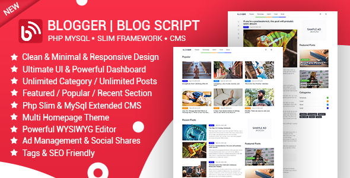

# Blogger

Blogger is a powerful PHP script to manage blog &amp; news. Blogger has a clean and minimal design that can make a great user experience. Blogger Script Design in PHP Slim Framework and Mysql. Author has better control to manage posts, category, section, pages, etc. Powerful CMS dashboard control every section on front end blog Design &amp; Logic.

